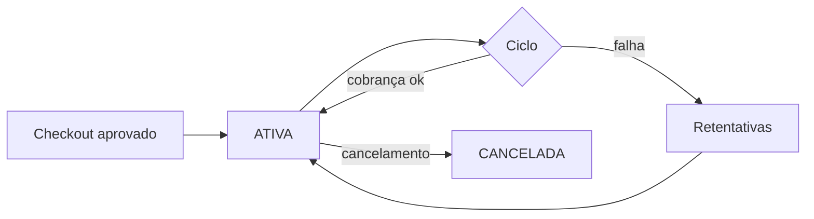

Uma **assinatura** nasce de uma [oferta](/catalogo-crm/produtos-e-ofertas) com cadência recorrente. A primeira cobrança acontece no checkout; as seguintes são agendadas automaticamente por ciclo.

## Modelo

| Objeto | Papel |
| --- | --- |
| Assinatura | Contrato de recorrência: comprador + oferta + cadência + estado |
| Fatura | Cobrança de cada ciclo, com valor e resultado |
| Oferta | Define valor recorrente e método (cartão ou PIX Automático) |

## Estados e ciclo

## Regras importantes

- O valor das faturas vem da oferta **no momento da assinatura** — mudar a oferta depois não altera assinaturas existentes.
- Cancelamento é imediato: nenhuma nova fatura; as pagas não são afetadas.
- O comprador pode gerenciar a assinatura no [portal do cliente](/pagamentos/assinaturas#portal-do-cliente) — o acesso é controlado por sessões que você cria e revoga por API.

<Tip>
No sandbox, use a simulação de ciclo para testar faturas e renovações sem esperar o calendário.
</Tip>
