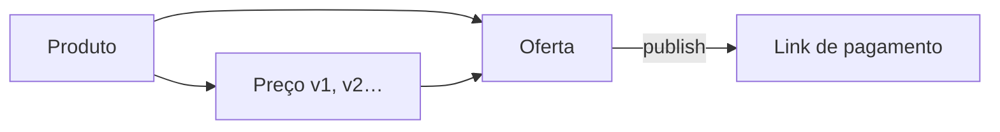

O catálogo separa três objetos com papéis distintos — essa separação é o que permite mudar preços sem quebrar links nem perder histórico:

## Produto

A "ficha" do que você vende: nome, descrição, referência externa e imagens. Arquivar impede novas ofertas e novas vendas.

## Preço

Sempre **inteiro em centavos** (BRL). Criar preço cria uma **versão** — o histórico é imutável e cada oferta aponta para a versão vigente.

## Oferta

Como o comprador pode pagar: métodos (`PIX`/`CARD`), `maxInstallments`, cadência (avulsa/recorrente). Estados:

| Estado | Efeito |
| --- | --- |
| Rascunho | Não vende |
| Publicada | Gera `publicCode` do [link](/api-reference/checkout) e aceita checkout |
| Arquivada | Sai do ar; sessões abertas completam dentro do TTL (30 min) |

## Uploads de imagem

Fluxo em 3 passos (solicitar → enviar ao storage → concluir), com validação do objeto **armazenado** (tipo, tamanho, checksum) — JPEG/PNG/WebP até 2 MiB.

## Tracking

Pixels de conversão (Meta, TikTok, Google) por produto, com credenciais criptografadas e conversão reportada **server-side** após a liquidação — veja [Tracking e pixels](/catalogo-crm/tracking).
