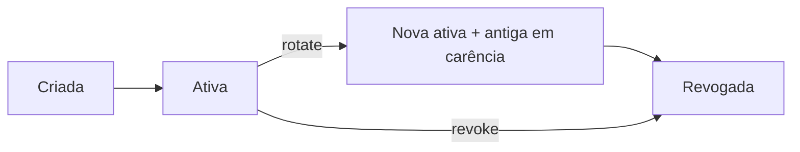

A chave de API é a credencial de servidor da sua integração: `kbt_{ambiente}_{publicId}_{secret}`.

## Modelo

| Propriedade | Comportamento |
| --- | --- |
| Ambiente | Derivado do prefixo (`live`/`test`) — chave errada no ambiente errado é rejeitada |
| Escopos | Lista fixa de permissões (`payments:*`, `payouts:*`, `refunds:*`, `commerce:*`, `webhooks:manage`, `iam:manage`) |
| Segredo | Exibido **uma única vez** na criação/rotação; armazenado só como hash server-side |
| Expiração | Opcional (`expiresAt`) — recomendado para chaves temporárias |

## Ciclo de vida

## Regras de ouro

1. **Uma chave por integração** — permite revogar cada serviço isoladamente e auditar uso por chave.
2. **Menor privilégio** — a chave nunca pode fazer mais que os escopos declarados na criação.
3. **Rotação periódica** — `rotate` com `gracePeriodSeconds` cobre o deploy sem downtime.
4. **Nunca no client** — a chave é segredo de servidor; o comprador nunca precisa dela.

<Warning>
Escopos financeiros (`payouts:write`, `refunds:write`, `iam:manage`) merecem o mesmo cuidado de uma senha de banco: chave dedicada, escopo mínimo e rotação.
</Warning>
