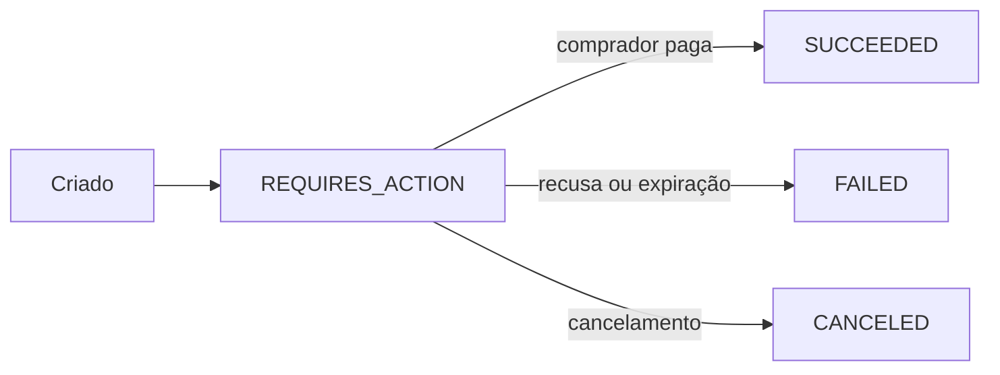

O **payment intent** é a unidade de cobrança da API Korbit. Ele carrega valor, método de pagamento e estado — e é por ele que a Korbit orquestra o processamento até a confirmação.

## Modelo

| Campo | Descrição |
| --- | --- |
| `id` | Identificador único (UUID) — use nos webhooks e na conciliação |
| `amount` | Valor total em centavos (BRL) — fixado server-side |
| `paymentMethod` | `PIX` ou `CARD` |
| `status` | Estado atual (ver ciclo abaixo) |
| `externalReference` | Seu identificador interno do pedido |
| `pix` / `cardAction` | Dados de pagamento quando `REQUIRES_ACTION` |

## Ciclo de vida

## PIX x Cartão

- **PIX**: a criação já devolve o código copia-e-cola/QR em `pix`. Confirmação pelo webhook `payment.succeeded.v1` (nunca por tela).
- **Cartão**: capturado no checkout hospedado com 3DS quando exigido. Enquanto o desafio do emissor está pendente, `cardAction` descreve a ação. Veja [Cartão e 3DS](/pagamentos/cartao-3ds).

## Conciliação

1. Guarde `externalReference` ↔ `id` no seu sistema.
2. Atualize estados por webhooks (`payment.created/…/failed`), confirmando pela API em decisões sensíveis.
3. Use `GET /v1/payment-intents/{id}` como fonte autoritativa — replays não mudam o estado.

<Tip>
Cobrança no sandbox não é paga de verdade: controle o desfecho com [simulação](/sandbox/simulate).
</Tip>
