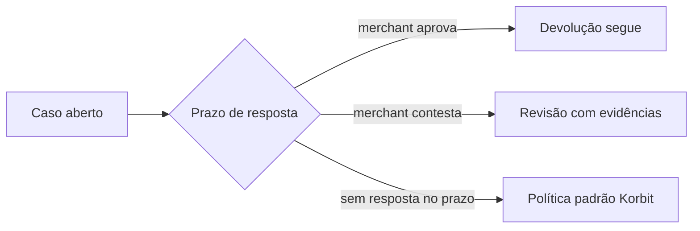

## Refund

Devolução de parte ou do total de um pagamento:

| Propriedade | Comportamento |
| --- | --- |
| Valor | `amountMinor` ≤ saldo restante do pagamento; acumulado nunca excede o total (validado transacionalmente) |
| Reserva | O valor é reservado **antes** da execução; falha reverte a reserva integralmente |
| Modo | `INSTANT` (executa já), `OPERATIONS` (revisão Korbit) ou `RISK_POLICY` (avaliação de risco) |

## Caso de refund (refund case)

Quando o refund não é instantâneo, abre-se um **caso** — a interação com o comprador:

- O prazo (`review_deadline_at`) chega no caso e no evento `refund.requested.v1`.
- Respostas adicionais (documentos, esclarecimentos) vão por `merchant-responses`.

## Disputas e chargebacks

Contestações abertas pelo comprador no banco (chargeback, MED) chegam como `dispute.opened.v1` e seguem fluxo próprio com upload de evidências e prazos regulatórios — o impacto financeiro reserva o valor da mesma forma que um refund.

<Tip>
Monitore `refund.requested.v1` e `refund.updated.v1` — perder o prazo do caso é a causa mais comum de devolução automática.
</Tip>
