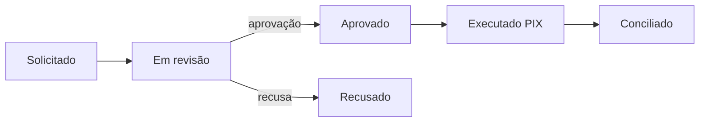

## Saldo

O saldo tem **três componentes** — consulte sempre o breakdown para entender o disponível:

| Componente | Significado |
| --- | --- |
| Disponível | Pode ser sacado agora |
| A liberar | Confirmado, aguardando a data de liberação |
| Reservado | Bloqueado por refunds/disputas em andamento |

## Liberações (funds releases)

Cada recebimento ganha uma data de liberação. A liberação pode ser **bloqueada** por eventos abertos — os motivos aparecem no item e o valor volta ao calendário quando o evento se resolve. Use `calendar` para projeção de caixa e `summary` para totais por período.

## Beneficiários

Chaves PIX de destino dos saques:

- Tipos: CPF, CNPJ, e-mail, telefone, chave aleatória (EVP).
- Armazenadas **criptografadas**; a API retorna só a chave mascarada.
- Uma é a **principal** (destino padrão); desabilitar não cancela saques já aprovados.

## Payout (saque)

Pontos-chave:

- O valor é **reservado** na solicitação — concorrência nunca excede o disponível.
- Há **verificação humana** na aprovação: não é instantâneo.
- Falha de execução devolve o valor ao disponível, com motivo registrado.

<Tip>
Precisa do dinheiro antes da liberação? Avalie [antecipação](/api-reference/antecipacoes) — tem custo, mas é imediata após aprovação.
</Tip>
