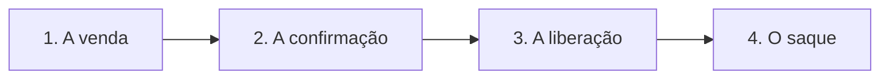

<Note>
Esta página é para quem cuida do negócio. Se você é quem vai escrever o código da integração, comece pela [Introdução à API](/api-reference/introducao).
</Note>

## A Korbit em uma frase

A Korbit é a plataforma que conecta o seu negócio digital ao dinheiro: você expõe o produto, o cliente paga por **PIX** ou **cartão**, e o valor chega ao seu saldo para você **sacar direto para PIX** — com assinaturas, antecipações e tudo o que existe entre a venda e o dinheiro na conta.

## A jornada do dinheiro

A melhor forma de entender a Korbit é acompanhar o que acontece com uma venda do início ao fim:

<Steps>
  <Step title="A venda">
    Você cria o produto e o preço no painel — ou pela API, se tiver um sistema. O comprador chega por um **link de pagamento** (perfeito para compartilhar no Instagram, WhatsApp ou na sua landing page) e conclui a compra numa página hospedada pela Korbit: escolhe PIX ou cartão, parcela se quiser e recebe a confirmação na tela.
  </Step>
  <Step title="A confirmação">
    Assim que o pagamento acontece, a Korbit valida tudo com o sistema financeiro — o PIX caiu? o cartão foi autorizado pelo banco? — e o pedido aparece no seu painel. Você não precisa ficar atualizando a tela: o aviso chega sozinho (é isso que os "webhooks" fazem, no linguajar técnico).
  </Step>
  <Step title="A liberação">
    Todo gateway tem um período entre a confirmação e o dinheiro ficar **disponível** — é o que garante que um reembolso ou uma contestação futura tenha de onde sair. No painel você acompanha exatamente **quando** cada valor vai liberar, num calendário claro, sem surpresa.
  </Step>
  <Step title="O saque">
    Com saldo disponível, você cadastra a sua chave PIX uma única vez e solicita o saque quando quiser. A Korbit confirma a execução e o comprovante — você acompanha cada etapa até o dinheiro bater na conta.
  </Step>
</Steps>

<CardGroup cols={1}>
  <Card title="Não quer esperar a liberação?" icon="clock" href="/antecipacoes/visao-geral">
    A **antecipação** adianta o valor de recebíveis futuros para hoje, com uma taxa de desconto. Você cota na hora e decide se vale a pena.
  </Card>
</CardGroup>

## O que você pode vender

<CardGroup cols={2}>
  <Card title="Produtos avulsos" icon="diamond">
    Cursos, e-books, mentorias, ingressos: o comprador paga uma vez e pronto. Por link de pagamento, sem loja virtual.
  </Card>
  <Card title="Assinaturas" icon="repeat">
    Planos mensais ou anuais com cobrança automática por ciclo — inclusive por PIX recorrente. O cliente pode trocar de plano ou cancelar sozinho no portal.
  </Card>
  <Card title="Order bumps" icon="plus-circle">
    Ofertas complementares na mesma tela de checkout ("adicione e economize"), aumentando o ticket médio de cada compra.
  </Card>
  <Card title="PIX e cartão" icon="credit-card">
    PIX para quem quer agilidade, cartão para quem quer parcelar — até 12x, com a verificação de segurança do banco (3DS) quando necessária.
  </Card>
</CardGroup>

## E quando dá problema?

Vender online também é lidar com arrependimento e contestação — e aqui a Korbit trabalha a seu favor:

- **Reembolsos** podem ser totais ou parciais, diretamente pelo painel, respeitando o valor já recebido.
- Quando o comprador **contesta** a compra no banco, você é avisado e tem um **prazo claro** para responder e enviar suas evidências — a Korbit organiza o caso para você não perder a discussão por falta de prazo.
- Tudo fica registrado: valores, estados e prazos de cada caso, sempre visíveis no painel e nas [exportações](/guias/exportacoes).

## Segurança, sem parágrafo técnico

O dinheiro e os dados passam por verificação de identidade da sua conta no cadastro (exigência regulatória para qualquer gateway), as chaves PIX dos saques ficam **criptografadas**, os dados dos compradores são tratados conforme a **LGPD**, e cada aviso que chega ao seu sistema vem **assinado** — ninguém finge ser a Korbit para o seu sistema.

## A Korbit faz sentido para o seu negócio?

<Accordion title="Vendo infoprodutos (cursos, mentorias, e-books)">
  É o caso clássico: link de pagamento no bio, checkout hospedado, order bumps para aumentar o ticket, assinaturas para comunidade e saque PIX quando quiser.
</Accordion>
<Accordion title="Tenho um SaaS">
  Assinaturas recorrentes com troca de plano e portal de autosserviço para o cliente — e a API para automatizar tudo no seu produto.
</Accordion>
<Accordion title="Tenho um e-commerce ou presto serviço">
  Links e checkout hospedado para vender sem desenvolver loja — ou integração completa pela API se você já tem sistema.
</Accordion>
<Accordion title="Não sou de tecnologia, e agora?">
  Você não precisa ser: o painel cobre o dia a dia (produtos, vendas, saldo, saques). Quando quiser automatizar, aí sim envolva alguém técnico — a documentação está pronta para isso.
</Accordion>

## Próximos passos

<CardGroup cols={2}>
  <Card title="Fazer a primeira venda" icon="rocket" href="/guias/quickstart">
    Do cadastro ao pagamento confirmado em menos de 10 minutos — passo a passo, sem código.
  </Card>
  <Card title="Conhecer a plataforma a fundo" icon="map" href="/api-reference/introducao">
    Visão geral da API e de como tudo se conecta — o ponto de partida técnico do seu time.
  </Card>
</CardGroup>
